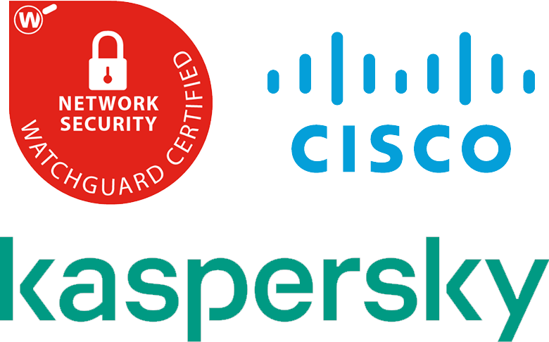

My name is Matis, i'm from Treviso-Italy.

I love Android, Linux and Music.

I'm also a referee, i reached the <a href="https://en.wikipedia.org/wiki/Seconda_Categoria">Seconda Categoria</a> level.

<h2>Projects</h2>
<ul>
	<li><a href="https://github.com/Rush-er/SickAdsNew">Block ads/trackers/malwares</a></li>
	<li><a href="https://github.com/Rush-er/PhotoS">Image editor for Windows</a></li>
	<li><a href="https://github.com/Rush-er/Viper4Linux-Configs">My presets for Viper4Linux</a></li>
	<li><a href="https://github.com/Rush-er/themeInstaller">Script for Theme installation linux</a></li>
        <li><a href="https://github.com/Rush-er/local_manifests">Local Manifest - Android rom building</a></li>
        <li><a href="https://github.com/Rush-er/buildROM">Automatically build Android rom</a></li>
        <li><a href="https://github.com/Rush-er/SiStall">Automatically install msi on Windows system</a></li>

</ul>

<h2>Certification</h2>
<ul class="skill-list">
	<li>CCNA R&S: Routing and Switching Essentials</li>
	<li>CCNA R&S: Connecting Networks</li>
	<li>CCNA R&S: Scaling Networks</li>
	<li>Cybersecurity Essentials</li>
	<li>WatchGuard Network Security</li>
	<li>WatchGuard Secure Wi-Fi Essentials</li>
	<li>WatchGuard Multi-Factor Authentication Essentials</li>
	<li>Kaspersky Endpoint Security and Management</li>
</ul>

&nbsp;
&nbsp;

